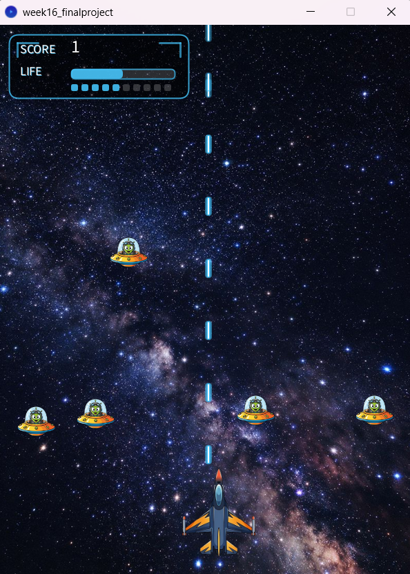

# Space Shooter Game

A 2D space shooter survival game developed with Processing.

本作品是一款使用 Processing 製作的飛機射擊生存遊戲。  
玩家可以使用 W、A、S、D 控制飛機移動，飛機會自動發射雷射攻擊從畫面上方出現的敵人。

遊戲加入生命值、分數、敵人血量、加速移動、重新開始、背景音樂與射擊音效等功能，並設計科幻風格 HUD 顯示目前分數與生命狀態。

## Demo

YouTube Gameplay Demo:  
https://youtu.be/7hnAZvnEaGo

## Project Preview

## Project Overview

本作品以飛機射擊生存挑戰為主題。

玩家主要透過移動飛機、對準敵人並持續生存來取得更高分數。飛機會自動連續發射雷射，因此玩家可以將注意力集中在移動、閃避與瞄準敵人。

敵人會從畫面上方隨機位置出現並向下移動，隨著移動時間增加，敵人的下降速度會逐漸加快，提高遊戲後期的挑戰性。

## Gameplay

- Use W / A / S / D to move the player aircraft
- The aircraft automatically fires laser shots
- Enemies randomly appear from the top of the screen
- Each enemy has a random amount of health
- Destroying an enemy increases the score by 1
- Enemies gradually accelerate while moving downward
- If an enemy reaches the bottom of the screen, the player loses 1 life
- The player starts with 10 lives
- When life reaches 0, the game ends
- Press R to start or restart the game

## Features

- Automatic shooting system
- Random enemy spawning
- Enemy health system
- Enemy acceleration
- Collision detection
- Score system
- Life system
- Best score tracking during the current session
- Game over and restart system
- Sci-fi HUD interface
- Background music
- Shooting sound effects

## Technologies

- Processing
- Java
- Processing Sound Library
- Object-Oriented Programming
- 2D Game Development

## Implementation

The game is organized using object-oriented programming.

### Player

The `Plane` class stores the player's position and handles aircraft rendering, movement, and boundary checking.

### Enemies

The `Enemy` class controls enemy movement, acceleration, health, collision detection, and respawning.

Each enemy is assigned a random amount of health when it is created.

### Shooting System

Bullets are represented by the `Ammo` class and stored in an `ArrayList`.

The player automatically fires at a fixed interval. Bullets are removed when they leave the screen or collide with an enemy.

### Collision Detection

The game checks whether a bullet overlaps with an enemy.

When a collision occurs, the enemy loses health. When the enemy's health reaches zero, the enemy is defeated and the player's score increases.

### Score and Life System

The player begins with 10 lives.

If an enemy reaches the bottom of the screen without being destroyed, the player loses one life and the enemy returns to the top of the screen.

When the player's life reaches zero, the game enters the Game Over state.

### HUD

The HUD displays the current score and remaining life using a sci-fi styled interface.

The life display includes both a life bar and individual indicators, allowing the player to quickly understand the current game status.

### Audio

The Processing Sound Library is used to provide background music and shooting sound effects.

## Controls

| Key | Action |
| --- | --- |
| W | Move Up |
| A | Move Left |
| S | Move Down |
| D | Move Right |
| R | Start / Restart |

## Project Structure

- `week16_finalproject.pde` - Main Processing program
- `sketch.properties` - Processing project settings
- `game-preview.png` - Project preview image
- `data/`
  - `background.png` - Space background image
  - `bgm.mp3` - Background music
  - `Enemy.png` - Enemy image
  - `Plane.png` - Player aircraft image
  - `shoot.wav` - Shooting sound effect

## How to Run

1. Install Processing.
2. Install the Processing Sound Library.
3. Open `week16_finalproject.pde`.
4. Make sure the `data` folder is kept inside the project folder.
5. Click Run in Processing.
6. Use W, A, S, and D to control the aircraft.
7. Press R to start or restart the game.

## Future Improvements

Future improvements could include:

- Adding different enemy types
- Adding multiple weapon types
- Designing different difficulty levels
- Adding boss battles
- Improving visual effects and animations
- Saving the best score between sessions

## Course Project

Processing Course Project

Developed by YuHsuan Chen.
